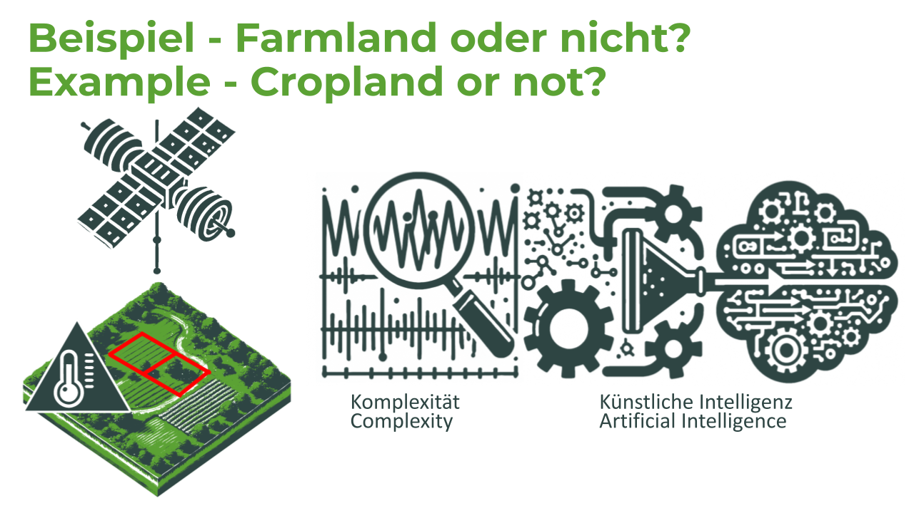

# CropHarvest Datenverarbeitung und Klassifikation – Panorama 2024

English version below

Dieses Repository enthält ein Analyseprojekt, das während der **Panorama 2024** Veranstaltung demonstriert wurde. Ziel des Projekts ist die Klassifikation von Ackerflächen mithilfe des CropHarvest-Datensatzes. Dabei wird die Varianz der zweiten Ableitung (`var2der`) als Komplexitätsmetrik für ausgewählte spektrale Bänder berechnet. Diese Merkmale werden anschließend zur Schulung von **CatBoost** und Klassifikatoren verwendet.

## Einführung

Dieses Projekt zielt darauf ab, Ackerflächen mithilfe von Satellitenbildern aus dem **CropHarvest**-Datensatz zu klassifizieren. Die Analyse umfasst die Auswahl spezifischer spektraler Bänder und die Berechnung der Varianz der zweiten Ableitung (`var2der`) als Maß für die Komplexität der zeitlichen Daten. Die extrahierten Merkmale dienen als Grundlage für das Training von Klassifikationsmodellen, die darauf abzielen, Landnutzungsmuster präzise zu identifizieren. Zusätzlich wird analysiert welche Parameter wichtig für die Identifikation von Landnutzungsmuster sind.

## Datensatz

Dieses Projekt nutzt den **CropHarvest**-Datensatz, der umfangreiche satellitenbasierte Zeitreihendaten zur Landnutzung enthält. Weitere Informationen zum CropHarvest-Datensatz sowie zu dessen Lizenzbedingungen finden Sie auf der [offiziellen CropHarvest GitHub-Seite](https://github.com/cropharvest).

**Hinweis:** Dieses Repository enthält keine Rohdaten des CropHarvest-Datensatzes. Die Daten werden zur Laufzeit über die CropHarvest-API geladen. Stellen Sie sicher, dass Sie die entsprechenden Nutzungsbedingungen und Lizenzvereinbarungen von CropHarvest einhalten.

## Komplexitätsmetrik

Für die Merkmalsextraktion wird die **Varianz der zweiten Ableitung (var2der)** verwendet, eine Komplexitätsmetrik, die auf der Arbeit von Raubitzek et al. basiert:

> **Raubitzek, S., Neubauer, T., Friedrich, J., & Rauber, A. (2022).** Interpolating Strange Attractors via Fractional Brownian Bridges. *Entropy*, 24(5), 718. [https://doi.org/10.3390/e24050718](https://www.mdpi.com/1099-4300/24/5/718)

Diese Metrik misst die Variabilität der zweiten Ableitung entlang einer gegebenen Trajektorie im Phasenraum und dient als Indikator für die Komplexität der Zeitreihendaten.

## Verwendete Modelle

Im Rahmen dieser Analyse wurden zwei Klassifikationsmodelle eingesetzt:

- **CatBoost Classifier:** Ein leistungsfähiger Gradient-Boosting-Algorithmus, der besonders gut mit kategorischen Merkmalen umgehen kann.

Das Model wurden anhand der extrahierten `var2der`-Merkmale trainiert und hinsichtlich ihrer Leistungsfähigkeit evaluiert.

## Anleitung zur Nutzung

### Voraussetzungen

- Python 3.7 oder höher
- Installierte Python-Bibliotheken:
  - cropharvest
  - h5py
  - numpy
  - pandas
  - matplotlib
  - catboost
  - scikit-learn
 

# CropHarvest Data Processing and Classification – Panorama 2024

This repository showcases an analysis project demonstrated during the **Panorama 2024** event. The goal of the project is to classify agricultural land using the CropHarvest dataset. It calculates the variance of the second derivative (`var2der`) as a complexity metric for selected spectral bands. These features are subsequently used for training **CatBoost** classifiers.

## Introduction

This project aims to classify agricultural land using satellite imagery from the **CropHarvest** dataset. The analysis involves selecting specific spectral bands and computing the variance of the second derivative (`var2der`) as a measure of the complexity of temporal data. The extracted features serve as the basis for training classification models designed to accurately identify land-use patterns.

## Dataset

This project utilizes the **CropHarvest** dataset, which contains extensive satellite-based time-series data on land use. More information about the CropHarvest dataset and its licensing terms can be found on the [official CropHarvest GitHub page](https://github.com/cropharvest).

**Note:** This repository does not include raw data from the CropHarvest dataset. Data is loaded at runtime via the CropHarvest API. Ensure compliance with the relevant terms of use and licensing agreements of CropHarvest.

## Complexity Metric

The **variance of the second derivative (var2der)** is used for feature extraction. This complexity metric is based on the work of Raubitzek et al.:

> **Raubitzek, S., Neubauer, T., Friedrich, J., & Rauber, A. (2022).** Interpolating Strange Attractors via Fractional Brownian Bridges. *Entropy*, 24(5), 718. [https://doi.org/10.3390/e24050718](https://www.mdpi.com/1099-4300/24/5/718)

This metric measures the variability of the second derivative along a given trajectory in phase space, serving as an indicator of the complexity of time-series data.

## Models Used

Two classification models were employed in this analysis:

- **CatBoost Classifier:** A powerful gradient boosting algorithm particularly adept at handling categorical features.

The model was trained on the extracted `var2der` features and evaluated for its performance.

## Usage Instructions

### Prerequisites

- Python 3.7 or higher
- Installed Python libraries:
  - cropharvest
  - h5py
  - numpy
  - pandas
  - matplotlib
  - catboost
  - scikit-learn

